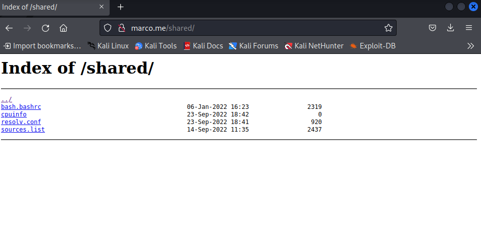

<center>

# UT1-A2: Listado de directorios


</center>

***Nombre:*** Marco José Gopar Mühlbacher
<br>
***Curso:*** 2º de Ciclo Superior de Administración de Sistemas Informáticos en Red.

### ÍNDICE

+ [Introducción](#id1)
+ [Objetivos](#id2)
+ [Material empleado](#id3)
+ [Desarrollo](#id4)
+ [Conclusiones](#id5)


#### ***Introducción***. <a name="id1"></a>

En esta práctica realizaremos un subdirectorio en `marco.me` que se llamara `marco.me/shared`. Dentro de se encontrará un listado de fichero.

#### ***Objetivos***. <a name="id2"></a>

Los objetivos de esta práctica son realizar un subdirectorio con contenido listado, que usará `autoindex on` y que los archivos listados sean enlaces simbólicos, que para ello usaremos el comando `ln -s directorio`.

#### ***Material empleado***. <a name="id3"></a>

Usamos una máquina virtual de Ubuntu 18.04 en adaptador puente con ip estática con esta ip `172.19.99.112` y una máquina Kali para configurar los DNS (se puede realizar con cualquier otra máquina, pero en mi caso, use esa porque era la que tenía), también en adaptador puente.

#### ***Desarrollo***. <a name="id4"></a>

Teniendo en cuenta que hemos realizado la práctica anterior [ut1-a1](https://github.com/MarcoJ18/IMW_Marco/tree/main/trim1/ut1/a1). Debemos entonces editar el fichero `/etc/nginx/sites-available/marco.me`.

```
sudo nano /etc/nginx/sites-available/marco.me 
```

Configurarlo de esta forma:

```
server {

        server_name marco.me;

        location /series {

                root /var/www/html;

        }


        location /shared {
                autoindex on;   # Lista los ficheros que están dentro de dicha carpeta 
                root /var/www/html;

        }


}

```

Una vez puesta la configuración debemos crear la carpeta `shared` dentro de `/var/www/html`. Y crear los enlaces simbólicos de los directorios requeridos.

```
cd /var/wwww/html
```

```
sudo mkdir shared
```

```
cd shared
```

Crear enlace simbolico:

```
sudo ln -s /etc/apt/sources.list
```
```
sudo ln -s /etc/resolv.conf
```
```
sudo ln -s /etc/bash.bashrc
```
```
sudo ln -s /proc/cpuinfo
```

Debería quedar así:


Comprobamos y reiniciamos:

```
sudo nginx -t 
```

```
sudo systemctl reload nginx.service
```

Resultado:




#### ***Conclusiones***. <a name="id5"></a>

Las conclusiones llegadas en esta práctica han sido el saber las directivas que tiene nginx dentro de su virtual host, como en esta caso autoindex y también se ha llegado a la conclusión del manejo de enlaces simbólicos dentro de nuestro host virtual.

